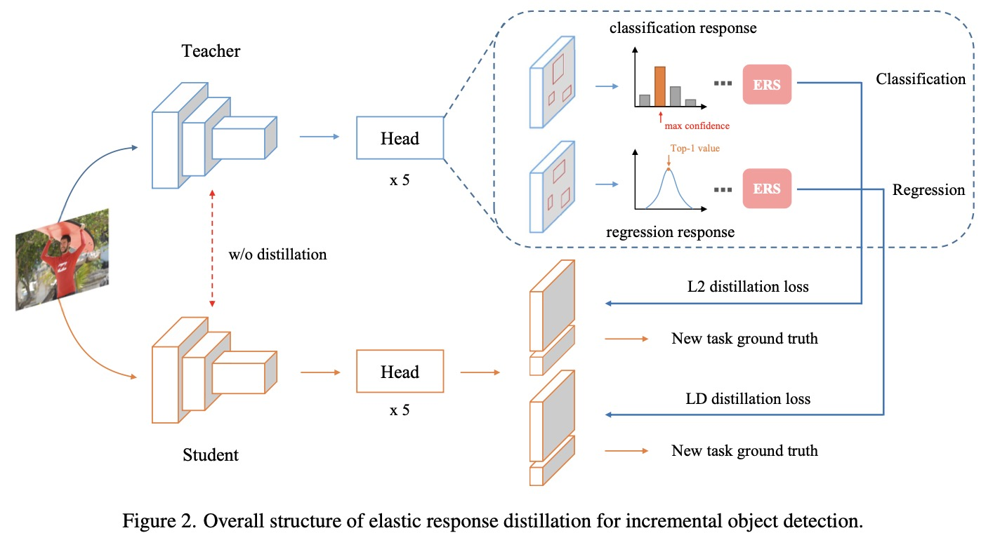

## Overcoming Catastrophic Forgetting in Incremental Object Detection via Elastic Response Distillation

Official Pytorch implementation for "[Overcoming Catastrophic Forgetting in Incremental Object Detection via Elastic Response Distillation](https://arxiv.org/abs/2204.02136)", CVPR 2022.

###  Introduction
Traditional object detectors are ill-equipped for incremental learning. However, fine-tuning directly on a well-trained detection model with only new data will lead to catastrophic forgetting. Knowledge distillation is a flexible way to mitigate catastrophic forgetting. In Incremental Object Detection (IOD), previous work mainly focuses on distilling for the combination of features and responses. However, they under-explore the information that contains in responses. In this paper, we propose a response-based incremental distillation method, dubbed Elastic Response Distillation (ERD), which focuses on elastically learning responses from the classification head and the regression head. Firstly, our method transfers category knowledge while equipping student detector with the ability to retain localization information during incremental learning. In addition, we further evaluate the quality of all locations and provide valuable responses by the Elastic Response Selection (ERS) strategy. Finally, we elucidate that the knowledge from different responses should be assigned with different importance during incremental distillation. Extensive experiments conducted on MS COCO demonstrate our method achieves state-of-the-art result, which substantially narrows the performance gap towards full training. 

<p align='left'>
  
</p>

### ====== 2023.07.04 Updated  ======
### Migrate code to the following newer environment
- Python 3.8
- PyTorch 1.13.1
- CUDA 11.6
- [mmdetection](https://github.com/open-mmlab/mmdetection) 3.0.0
- [mmcv](https://github.com/open-mmlab/mmcv) 2.0.0

### Get Started

This repo is based on [MMDetection 3.0](https://github.com/open-mmlab/mmdetection). Please refer to [GETTING_STARTED.md](https://mmdetection.readthedocs.io/en/v3.0.0/get_started.html) for the basic configuration and usage of MMDetection.
Or follow the steps below to install

```python
conda create -n ERD python=3.8 -y

source activate ERD

conda install pytorch==1.13.1 torchvision==0.14.1 torchaudio==0.13.1 pytorch-cuda=11.6 -c pytorch -c nvidia

pip install tqdm

pip install -U openmim

mim install mmengine==0.7.3

mim install mmcv==2.0.0

# cd erd 
pip install -v -e .
```

You can run /script/select_categories.py to split the COCO dataset as you want,

```python
# to generate instances_train2017_sel_last_40_cats.json
python ./script/select_categories.py

```


### Train
```python
# assume that you are under the root directory of this project,
# and you have activated your virtual environment if needed.
# and with COCO dataset in '/dataset/coco/'

# train first 40 cats
CUDA_VISIBLE_DEVICES=0,1 ./tools/dist_train.sh configs/gfl_increment/gfl_r50_fpn_1x_coco_first_40_cats.py 2 --work-dir=../ERD_results/gfl_increment/gfl_r50_fpn_1x_coco_first_40_cats
#train last 40 cats incrementally
CUDA_VISIBLE_DEVICES=0,1 ./tools/dist_train.sh configs/gfl_increment/gfl_r50_fpn_1x_coco_first_40_incre_last_40_cats.py 2 --work-dir=../ERD_results/gfl_increment/gfl_r50_fpn_1x_coco_first_40_incre_last_40_cats
```

### Test
```python
# test first 40 cats
CUDA_VISIBLE_DEVICES=0,1 ./tools/dist_test.sh configs/gfl_increment/gfl_r50_fpn_1x_coco_first_40_cats.py ../ERD_results/gfl_increment/gfl_r50_fpn_1x_coco_first_40_cats/epoch_12.pth 2 --cfg-options test_evaluator.classwise=True
#test all 80 cats on the incre model
CUDA_VISIBLE_DEVICES=0,1 ./tools/dist_test.sh configs/gfl_increment/gfl_r50_fpn_1x_coco_first_40_incre_last_40_cats.py ../ERD_results/gfl_increment/gfl_r50_fpn_1x_coco_first_40_incre_last_40_cats/epoch_12.pth 2 --cfg-options test_evaluator.classwise=True

```

### Citation
Please cite the following paper if this repo helps your research:
```bibtex
@InProceedings{ERD,
    author    = {Tao Feng and Mang Wang and Hangjie Yuan},
    title     = {Overcoming Catastrophic Forgetting in Incremental Object Detection via Elastic Response Distillation},
    booktitle = {Proceedings of the IEEE/CVF Conference on Computer Vision and Pattern Recognition},
    year      = {2022}
}
```
